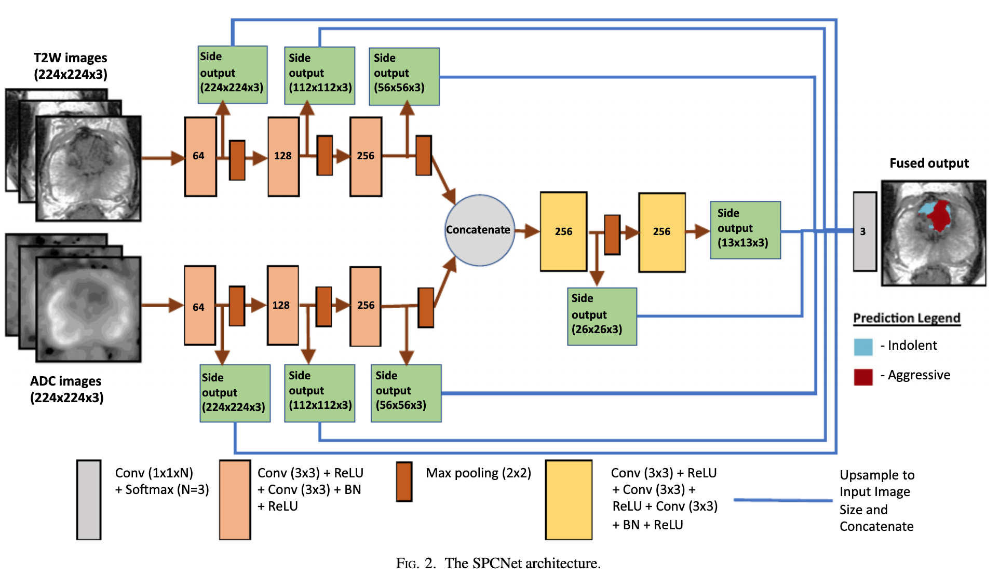
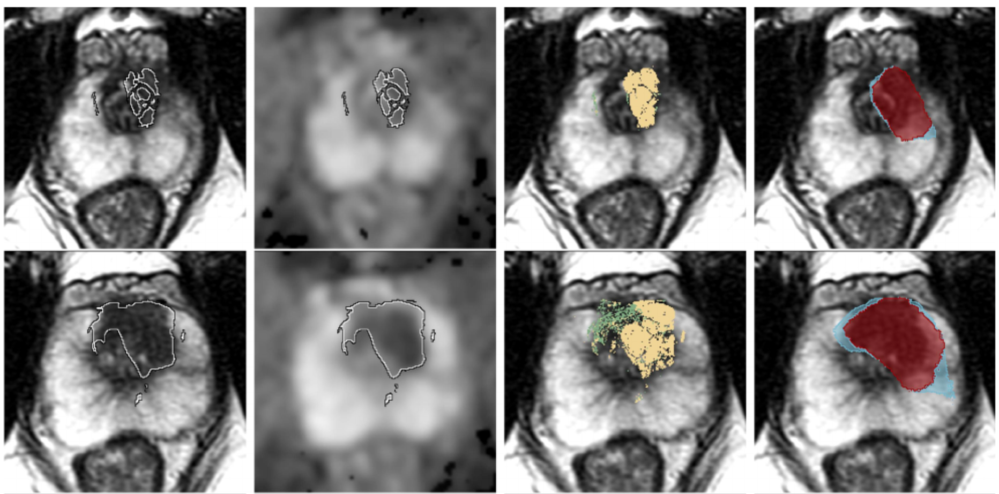

<div align="center">

# SPCNet: Automated detection of aggressive and indolent prostate cancer on magnetic resonance imaging

[](https://arxiv.org/abs/2011.11390)
[](https://aapm.onlinelibrary.wiley.com/doi/epdf/10.1002/mp.14855)

</div>

TensorFlow implementation of our paper: "[Arun _et al_.: Automated detection of aggressive and indolent prostate cancer on magnetic resonance imaging [Medical Physics 2021]](https://aapm.onlinelibrary.wiley.com/doi/epdf/10.1002/mp.14855)".

Our source code has been tested successfully on Windows 10, Cuda 10.1, RTX 2080 Ti, Anaconda Python 3.7, Tensorflow 1.14 - 2.0.0

The code is only for research purposes. If you have any questions regarding how to use this code, feel free to contact Dr.Mirabela Rusu ([Mirabela@stanford.edu](Mirabela@stanford.edu)).

<table align="center" border=0><tr><td align="center" width="9999">

</td></tr></table>

---
## Abstract
While multi-parametric magnetic resonance imaging (MRI) shows great promise in assisting with prostate cancer diagnosis and localization, subtle differences in appearance between cancer and normal tissue lead to many false positive and false negative interpretations by radiologists. We sought to automatically detect aggressive cancer (Gleason pattern ≥ 4) and indolent cancer (Gleason pattern 3) on a per-pixel basis on MRI to facilitate the targeting of aggressive cancer during the biopsy. We created the Stanford Prostate Cancer Network (SPCNet), a convolutional neural network model trained to distinguish between aggressive cancer, indolent cancer, and normal tissue on MRI. Ground truth cancer labels were obtained by registering MRI with whole-mount digital histopathology images from patients who underwent radical prostatectomy. Before registration, these histopathology images were automatically annotated to show Gleason patterns on a per-pixel basis. The model was trained on data from 78 patients who underwent radical prostatectomy and 24 patients without prostate cancer. The model was evaluated on a pixel and lesion level in 322 patients, including six patients with normal MRI and no cancer, 23 patients who underwent radical prostatectomy, and 293 patients who underwent biopsy. Moreover, we assessed the ability of our model to detect clinically significant cancer (lesions with an aggressive component) and compared it to the performance of radiologists.

<table align="center" border=0><tr><td align="center" width="9999">


**Model prediction for aggressive and indolent cancers in T2-weighted MRI test cases.**
</td></tr></table>

---

## Dataset
Our study included patients data from two independent cohorts acquired at Stanford Medicine, and it can not be shared at the moment. A detailed description of the training data can be found in the paper. For further information, please contact Dr.Mirabela Rusu ([Mirabela@stanford.edu](Mirabela@stanford.edu)).

## Dependencies
- Python 3.7
- TensorFlow 1.14 - 2.0.0
- SimpleITK 1.2.2
- scikit-image
- scikit-learn

## Installation
 Please clone the repo as follows:
 
 ```
 git clone https://github.com/PIMED/SPCNet/
 cd SPCNet
```
To run the code without any OS compatibility issue the `environment.yml` is already exported (Windows 10). You can create the same environment as follows:
 ```
conda env create -f environment.yml
conda activate tf_gpu
```


## Train SPCNET On Your Data
To train SPCNET on your data, you can run train.py file as following:
 
 ```python -u train.py --output_filepath OUTPUT_FOLDER  --t2_filepath  T2_FOLDER --adc_filepath ADC_FOLDER --mask_filepath ADC_T2_FOLDER --all_cancer_filepath CANCER_FOLDER_LABEL --agg_cancer_filepath AGGRESIVE_LABEL FOLDER --ind_cancer_filepath INDOLET_LABEL_FOLDER```
 

## Evaluate
We have evaluated the accuracy performance of SPCNET for indolent/aggressive cancer detection on three different levels, including patient-level, lesion-level, and pixel-level accuracy.

To test the trained model and compute the different metrics for all the levels, you can run the evaluation.py file as following:

```python -u evaluation.py --output_filepath OUTPUT_FOLDER  --t2_filepath  T2_FOLDER --adc_filepath ADC_FOLDER --mask_filepath ADC_T2_FOLDER all_cancer_filepath CANCER_FOLDER_LABEL --agg_cancer_filepath AGGRESIVE_LABEL FOLDER --ind_cancer_filepath INDOLET_LABEL_FOLDER ```

---

## Citations
Please consider citing the following papers in your publications if source code helped your research.
```bibtex
@article{Seetharaman2021,
author = {Seetharaman, Arun and Bhattacharya, Indrani and Chen, Leo C. and Kunder, Christian A. and Shao, Wei and Soerensen, Simon J. C. and Wang, Jeffrey B. and Teslovich, Nikola C. and Fan, Richard E. and Ghanouni, Pejman and Brooks, James D. and Too, Katherine J. and Sonn, Geoffrey A. and Rusu, Mirabela},
title = {Automated detection of aggressive and indolent prostate cancer on magnetic resonance imaging},
journal = {Medical Physics},
volume = {n/a},
number = {n/a},
pages = {},
year = {2020},
doi = {https://doi.org/10.1002/mp.14855}}

@article{Rusu2020,
author = {Rusu, Mirabela and Shao, Wei and Kunder, Christian A. and Wang, Jeffrey B. and Soerensen, Simon J. C. and Teslovich, Nikola C. and Sood, Rewa R. and Chen, Leo C. and Fan, Richard E. and Ghanouni, Pejman and Brooks, James D. and Sonn, Geoffrey A.},
title = {Registration of presurgical MRI and histopathology images from radical prostatectomy via RAPSODI},
journal = {Medical Physics},
volume = {47},
number = {9},
pages = {4177-4188},
keywords = {cancer labels, histopathology, MRI, prostate cancer, registration},
doi = {https://doi.org/10.1002/mp.14337},
year = {2020}
}
```
